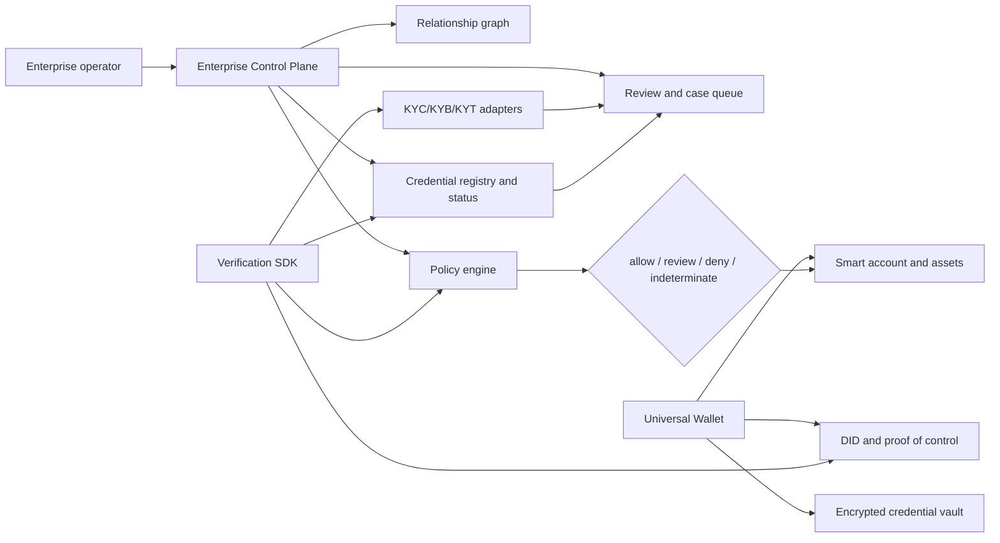

# Composable compliance platform

**Status:** public architecture and product design  
**Scope:** enterprise operations, Universal Wallet, Verification SDK and
transaction-risk integrations  
**Evidence boundary:** the repository currently contains synthetic fixtures and
local/testnet evidence. Production KYC/KYB/KYT providers, legal reliance,
certification and regulatory approval are external work.

## Product definition

Universal Smart Wallet is composed into four installable surfaces:

1. **Enterprise Control Plane** — a tenant-scoped administration panel for
   organisations, relationships, credentials, policies, wallets, alerts and
   compliance cases.
2. **Universal Wallet** — the holder or business wallet containing a smart
   account, DID, encrypted credentials, authenticators, delegated signers and
   assets.
3. **Verification SDK** — browser/server/mobile-neutral APIs that let any
   internal or external process verify credentials, wallet control, policies,
   sanctions and transaction risk.
4. **Policy and Monitoring services** — deterministic policy decisions,
   event-driven re-checks and KYT connectors. These services produce evidence
   and decisions; they do not make an issuer or customer legally compliant by
   themselves.

## Reference topology



The control plane does not automatically receive the full credential payload
or private keys. It operates on typed evidence, opaque identifiers, status,
freshness, policy versions and redacted audit events.

## Enterprise Control Plane

Each enterprise is a tenant with explicit roles and step-up requirements.

### Core modules

| Module | Responsibility | Example output |
| --- | --- | --- |
| Organisation | Legal entity, jurisdiction, UBO and representative relationships | `organisation.status = verified` |
| Wallet fleet | Wallet locators, DID bindings, chain/account deployments and signer roles | `walletControl = verified` |
| Credential registry | Issuer, schema, subject, status, expiry and evidence references | `credential.status = active` |
| Relationship graph | Customer, supplier, counterparty, operator, agent and mandate edges | `relationship.role = authorised_payer` |
| Policy studio | Allowed chains, contracts, functions, assets, amounts, jurisdictions and TTLs | `merchant-payout-v1` |
| Transaction monitoring | KYT signals, sanctions/PEP results, counterparty exposure and alerts | `risk = review` |
| Case management | Human review, two-person approval, reason codes and disposition | `case = escalated` |
| Audit and exports | Redacted decisions, evidence references, policy versions and timestamps | review package without secrets |
| Webhooks | Credential change, risk alert, revocation, signer change and decision events | `credential.revoked` |

### Relationship graph

The graph should model relationships rather than flatten them into a user
record:

```text
Organisation
 ├── controlled_by → Person / legal representative
 ├── owns_or_controls → Smart wallet
 ├── authorised_operator → Signer / agent
 ├── transacts_with → Counterparty
 ├── issued_by → Trust issuer
 └── subject_to → Policy / jurisdiction
```

Every edge needs an issuer, evidence reference, validity interval and revocation
state. An email address alone must never create a legal or cryptographic
relationship.

## Universal Wallet model

The wallet is the user-controlled execution and credential boundary.

### Wallet state

- smart account and chain deployment metadata;
- default private or pairwise DID identifiers;
- encrypted VC and presentation vault;
- passkey, recovery and optional email/social authentication modules;
- owner, guardian and operational signer relationships;
- delegated capabilities with limits and expiry;
- ERC-20/ERC-721/ERC-1155/native assets;
- encrypted export/import and vendor rotation state.

### Enterprise relationship to the wallet

An enterprise may provision or administer a wallet fleet, but authority must be
explicitly scoped:

- email or social login creates a principal/session, not permanent ownership;
- operational signers cannot install an irremovable vendor owner;
- owner rotation, export, module installation and asset migration require
  passkey or recovery step-up;
- a user can present a credential without giving the verifier the entire vault;
- an organisation can prove control of a wallet without revealing private keys.

## Credential and evidence layers

The system should distinguish evidence types:

| Evidence | Issuer | Reusable claim | Must be rechecked when |
| --- | --- | --- | --- |
| Legal entity/KYB | Registry or KYC/KYB provider | Entity exists, jurisdiction, registration | Registry change, expiry or material event |
| UBO/controller | Approved identity/kyb issuer | Person is authorised or owns a share | Ownership/director change |
| Licence/permission | Regulator or authorised issuer | Activity is permitted | Licence expiry, suspension or jurisdiction change |
| Sanctions/PEP | Screening provider | Result at timestamp under a method/version | New list/event or policy TTL |
| Wallet control | Wallet/DID proof | Subject controls account/signer | Key rotation, account change or challenge expiry |
| Transaction risk | KYT provider/operator | Transfer/counterparty risk observation | Every material transaction and retrospective alert |
| Internal mandate | Enterprise policy authority | Operator may perform bounded action | Role, policy, amount or time-window change |

The platform must preserve provenance: issuer, schema, method, policy,
timestamp, freshness, status, jurisdiction and evidence reference. A generic
`low_risk = true` claim without provenance is not sufficient.

## Verification SDK

The SDK is the integration surface for internal services, partner APIs, mobile
apps, admin panels and smart-account transaction flows.

### Suggested API boundaries

```ts
const decision = await universal.verify({
  subject: { did, walletAddress },
  credentials: ['kyb', 'authorised-representative'],
  transaction: {
    chainId: 8453,
    asset: 'USDC',
    amount: '10000',
    target: '0x...',
  },
  policy: 'merchant-payout-v1',
});
```

The result is deliberately finite:

```ts
type VerificationDecision = {
  decision: 'allow' | 'review' | 'deny' | 'indeterminate';
  policyVersion: string;
  subject: string; // opaque identifier, never email or raw DID by default
  evidence: readonly EvidenceReference[];
  reasons: readonly string[];
  freshness: 'fresh' | 'stale' | 'unknown';
  kyt?: { status: 'clear' | 'flagged' | 'unknown'; reference: string };
  expiresAt?: string;
};
```

### SDK modules

```text
identity.verifyCredential()
identity.verifyDidBinding()
identity.verifyWalletControl()
compliance.verifyKyc()
compliance.verifyKyb()
compliance.checkSanctions()
compliance.screenTransaction()
wallet.authorizeIntent()
wallet.simulateTransaction()
wallet.createPresentationRequest()
monitoring.subscribeToRiskEvents()
```

Every adapter must be replaceable. The core SDK cannot assume a specific
issuer, KMS, SMTP provider, OIDC provider, RPC, bundler, paymaster or KYT
vendor.

## Transaction lifecycle

### Onboarding

1. Create an opaque tenant-scoped organisation/wallet locator.
2. Run KYC/KYB and collect issuer-signed evidence.
3. Bind the organisation DID and authorised representative to the wallet.
4. Configure signer, asset, chain, contract and amount policies.
5. Issue a credential bundle with expiry and status endpoints.

### Pre-transaction

1. Load the relationship and current policy.
2. Verify credential signature, issuer trust, status and freshness.
3. Verify wallet and signer control.
4. Screen source, destination and counterparty through KYT/sanctions adapters.
5. Simulate the transaction and enforce calldata/amount/chain limits.
6. Return `allow`, `review`, `deny` or `indeterminate`.
7. Require human or second-party approval when policy says so.
8. Authorise and submit through the smart-account adapter.

### Continuous monitoring

The system emits events for:

- credential expiry, suspension or revocation;
- UBO/director or licence change;
- wallet owner, module or signer change;
- KYT counterparty exposure or retrospective alert;
- policy version change;
- repeated failed or anomalous actions;
- issuer trust or status-registry outage.

Events can downgrade a relationship or freeze a capability, but irreversible
actions require the configured enterprise and user controls. Unknown status
must produce `indeterminate`, not silent approval.

## Data and privacy boundary

```text
Wallet vault: full VC, private presentation material, recovery data
Control plane: opaque locators, claims metadata, status, policy and audit refs
Chain: assets, account state, bounded attestations/commitments when required
KYT provider: transaction/address data under its contract and retention policy
Verifier: only requested claims and a privacy-minimal decision receipt
```

The platform must not place full VC payloads, PII, email addresses, OTPs,
private keys or recovery material on-chain or in audit logs. The enterprise
panel should show why a decision was made without exposing more identity data
than the operator is authorised to see.

## Existing repository mapping

| Designed surface | Current implementation boundary | Maturity |
| --- | --- | --- |
| Enterprise Control Plane | `apps/admin-console`, `apps/wallet-service` | Synthetic/local reference |
| Universal Wallet | `apps/wallet-app`, `apps/wallet-mobile`, wallet SDKs | Local/testnet reference |
| Credential issuer/holder/verifier | `packages/identity-sdk`, issuer/verifier services | Synthetic provider ports |
| Scanner and presentations | `packages/credential-scanner`, wallet/admin scanner | Bounded local flows |
| Smart-account policy | `packages/wallet-actions`, `packages/signer-policy`, account adapters | Policy/test harnesses |
| Trust/status | `packages/trust-registry`, identity services | Signed local fixtures |
| Portability | `packages/wallet-portability` | Encrypted migration protocol |
| KYT/sanctions connectors | Not yet a production integration | Future implementation |
| Relationship graph/case management | Partial tenant/admin primitives | Future implementation |

## Installation profiles

An integrator should be able to install only the required modules:

| Profile | Modules |
| --- | --- |
| Holder wallet | wallet core, vault, auth, DID, credential holder |
| Issuer | issuer SDK, signer/KMS port, templates, status |
| Verifier | verifier SDK, trust/status, scanner, policy |
| Enterprise compliance | tenant store, relationship graph, policy, cases, KYT adapters, audit |
| Transaction service | wallet SDK, account adapter, simulation, signer policy, monitoring |
| Self-hosted operator | all selected services with Postgres/KMS/RPC adapters |

## Implementation phases

### Phase A — Evidence and policy foundation

- typed evidence references and freshness rules;
- relationship graph with tenant isolation;
- policy decision object and reason codes;
- webhook/event schema;
- deterministic synthetic KYT adapter.

### Phase B — Enterprise pilot

- one KYB provider adapter;
- one KYT provider adapter;
- organisation credential bundle;
- wallet-control proof;
- review queue and two-person approval;
- policy-gated Base/Scroll testnet transaction flow.

### Phase C — Interoperability and operations

- OpenID4VCI/VP issuer and verifier integration;
- status/revocation and trust registry federation;
- EUDI/business-wallet interoperability assessment;
- audit export and retention controls;
- vendor rotation and self-hosted deployment validation.

## Non-claims

This architecture does not claim to replace regulated KYC/KYB/KYT obligations,
make a credential universally acceptable, establish legal identity from a DID
or address, or provide production compliance without qualified issuers,
policies, monitoring and governance.
