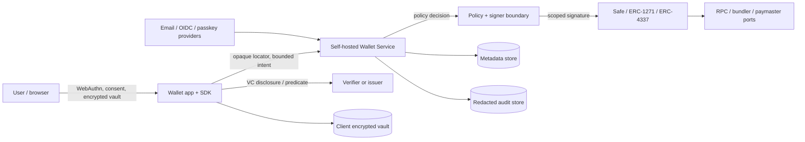

# Wallet Platform trust-boundary and data-flow threat model

**Scope:** SSW-029 architecture for the modular SDK, self-hosted service,
wallet app, admin console, authentication adapters, Safe account control,
credential vault, DID and portability flows.  
**Maturity:** planning/synthetic local and explicitly configured testnets only.
This document supports review; it is not an independent audit or production
approval.

## Assets and security goals

| Asset                                | Goal                                                                                  |
| ------------------------------------ | ------------------------------------------------------------------------------------- |
| Safe owner/recovery authority        | Only the user-controlled owner or threshold can make irreversible account changes     |
| Operational signer policy            | Least privilege, short TTL, nonce-bound, revocable and tenant-scoped                  |
| Credential vault and recovery bundle | Confidentiality and integrity; no plaintext VC, DEK or recovery secret in the service |
| Principal-to-wallet mapping          | Tenant isolation and opaque locators; prevent account enumeration and linking         |
| DID and holder bindings              | Stable control proof without unnecessary public correlation                           |
| Transaction intents and audit        | Authenticity, idempotency, redaction and useful incident evidence                     |

## Trust boundaries

The browser/vault, service, policy/signer, account/chain, identity providers,
and verifiers are separate boundaries. A provider adapter is not a trust root:
it returns verified, bounded evidence to the service and cannot make itself a
Safe owner.

## Data-flow controls

| Flow                    | Allowed data                                                   | Required control                                                            | Forbidden data                                       |
| ----------------------- | -------------------------------------------------------------- | --------------------------------------------------------------------------- | ---------------------------------------------------- |
| Auth provider → service | Verified `issuer + subject`, challenge result, bounded claims  | Issuer/audience/nonce/PKCE or WebAuthn validation; anti-enumeration         | Raw OAuth token in logs, email as wallet locator     |
| SDK → service           | Tenant-scoped opaque locator, intent, idempotency key          | Schema/size limits, authorization and rate limits                           | VC, PII, DEK, passkey private material               |
| Service → store         | Wallet metadata, policy version, transaction state             | Tenant keying, transactionality, encryption at rest delegated to deployment | Plaintext credential, OTP, recovery secret           |
| Wallet → verifier       | Explicit disclosure or minimal predicate result                | Consent, audience, nonce, expiry, trust/status and replay checks            | Unrequested claims, stable cross-verifier identifier |
| Policy → Safe           | Exact target/data/value/chain/nonce and signer authorization   | Simulation, selector/asset limits, code-hash and EntryPoint checks          | Arbitrary calldata by default, unbounded approval    |
| Wallet → chain          | Commitment/pseudonym, policy/audience/nonce/expiry when needed | Short-lived attestation and chain/consumer binding                          | VC, DID document, PII                                |
| Vendor export/import    | Signed versioned encrypted bundle                              | User/recovery authorization, integrity, replay and rollback checks          | Silent asset movement or vendor-only recovery        |

## Threats and mitigations

| Threat                                          | Impact                                  | Mitigation / expected failure                                                                                                         |
| ----------------------------------------------- | --------------------------------------- | ------------------------------------------------------------------------------------------------------------------------------------- |
| Email account takeover                          | Operational signer misuse               | Short TTL, narrow policy, rate limits, mandatory step-up for sensitive operations, revocation; disclose email-only custody            |
| Social account/email collision                  | Wrong wallet linked to a user           | Canonical identity is `issuer + subject`; explicit linking and step-up; never match email alone                                       |
| Vendor signer escalation                        | Permanent vendor custody                | Signer cannot change Safe owner/threshold/modules or policy without user-controlled step-up; all capabilities are revocable           |
| Replay of auth or transaction intent            | Duplicate transfer or credential action | Challenge nonce, intent nonce, idempotency key, expiry, consumed-state store and chain ID binding                                     |
| Tenant confusion / locator guessing             | Cross-tenant data or wallet access      | Opaque high-entropy locator, tenant-scoped authorization at every store/API boundary, generic not-found response                      |
| Malicious calldata / token approvals            | Asset loss                              | Typed asset actions, target/selector allowlists, amount caps, simulation, human-readable preview; arbitrary calls disabled by default |
| RPC/bundler/paymaster spoofing                  | Wrong chain or signature context        | Injected ports, pinned chain/EntryPoint/factory/code hashes, endpoint allowlists, fail closed on mismatch                             |
| OIDC issuer/JWKS compromise or misconfiguration | Account takeover                        | Exact issuer/audience, nonce/state/PKCE, JWKS freshness and rotation, provider config review, explicit unlink                         |
| SMTP/OTP interception or brute force            | Session compromise                      | Random hashed single-use OTP, short expiry, attempt/rate limits, anti-enumeration, no OTP logs                                        |
| Vault or export leakage                         | Credential/identity disclosure          | Client-side authenticated encryption, session-only plaintext, signed encrypted export, no server DEK, redact audit                    |
| DID correlation                                 | Privacy loss                            | Local `did:pkh`, pairwise presentation identifiers, no automatic on-chain registration or universal resolver dependency               |
| Status/trust/resolver outage                    | Unsafe acceptance or denial             | Fail closed for verification; bounded retry/timeouts; generic denial; no silent bypass                                                |
| Provider outage or migration tampering          | Availability or asset movement          | Adapter health states, resumable idempotent operations, signed bundle validation, explicit user approval for transfers                |
| Log/telemetry exfiltration                      | PII/secrets leakage                     | Redacted append-only audit port, schema rejection of forbidden fields, secret scans and review                                        |
| Supply-chain/module upgrade                     | Control bypass                          | Version pins, license/provenance review, code-hash records, conformance fixtures, independent review before testnet                   |

## Review gaps and blockers

- SSW-026 contains no independent audit; reviewers must re-run its packet and
  inspect the new adapters before any production or valuable-asset claim.
- Safe/EntryPoint/ERC-7579 deployment and module versions require per-chain
  code-hash verification. A changed hash blocks startup.
- WebAuthn PRF, KMS/HSM, SMTP, OIDC, RPC, bundler, paymaster, status and DID
  resolver behavior remain adapter-specific and require conformance tests.
- Email-only and social-only onboarding cannot be described as self-custody
  until a user-controlled recovery owner exists.
- Local tests use synthetic identities/assets and must not contact hosted
  issuers, verifiers, RPCs, bundlers, paymasters or real SMTP.

## Acceptance review mapping

| Review item                                | Evidence                                                                                                                                       | Result |
| ------------------------------------------ | ---------------------------------------------------------------------------------------------------------------------------------------------- | ------ |
| Threat-model review against SSW-026 packet | Trust boundaries align with `docs/architecture/SSW-026-data-flow.md`; custody, vault, replay, redaction and account controls are extended here | PASS   |
| Email custody limitation                   | Email takeover/custody row and required product disclosure                                                                                     | PASS   |
| Sensitive-operation step-up                | Policy, signer-escalation and auth rows; passkey/recovery required                                                                             | PASS   |

## References

- [SSW-026 review packet](../audit/SSW-026-review-packet.md)
- [SSW-026 data-flow evidence](../architecture/SSW-026-data-flow.md)
- [SSW-006 vault threat model](SSW-006-vault-key-management.md)
- [SSW-022 consent/privacy threat model](SSW-022-consent-privacy-hardening.md)
- [SSW-024 adversarial hardening threat model](SSW-024-adversarial-hardening.md)
