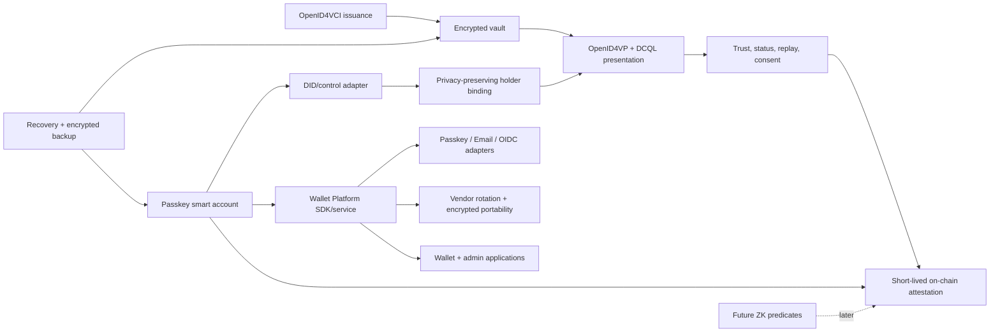

# Feature relations

## Boundary rules

- Credential exchange works without the smart account or DID adapters.
- Smart-account recovery must not imply that an encrypted vault is recoverable;
  both paths require explicit tests.
- Holder binding must not force reuse of one public identifier across verifiers.
- Status/trust failures are terminal verification failures, not warnings.
- On-chain attestations consume a minimal verification result, never a
  credential or disclosed PII.
