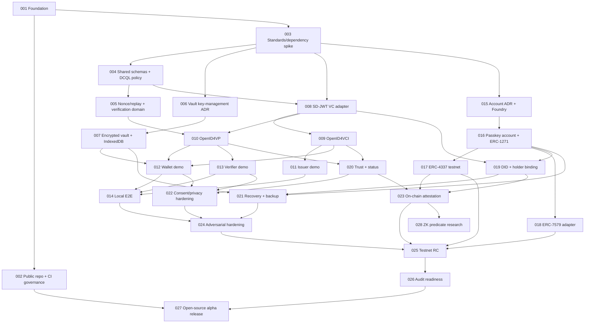

# Dependency graph

```mermaid
flowchart TD
  T001[001 Foundation] --> T002[002 Public repo + CI governance]
  T001 --> T003[003 Standards/dependency spike]
  T003 --> T004[004 Shared schemas + DCQL policy]
  T004 --> T005[005 Nonce/replay + verification domain]
  T003 --> T006[006 Vault key-management ADR]
  T006 --> T007[007 Encrypted vault + IndexedDB]
  T003 --> T008[008 SD-JWT VC adapter]
  T004 --> T008
  T008 --> T009[009 OpenID4VCI]
  T005 --> T010[010 OpenID4VP]
  T008 --> T010
  T009 --> T011[011 Issuer demo]
  T007 --> T012[012 Wallet demo]
  T009 --> T012
  T010 --> T012
  T010 --> T013[013 Verifier demo]
  T011 --> T014[014 Local E2E]
  T012 --> T014
  T013 --> T014
  T003 --> T015[015 Account ADR + Foundry]
  T015 --> T016[016 Passkey account + ERC-1271]
  T016 --> T017[017 ERC-4337 testnet]
  T016 --> T018[018 ERC-7579 adapter]
  T008 --> T019[019 DID + holder binding]
  T016 --> T019
  T009 --> T020[020 Trust + status]
  T010 --> T020
  T007 --> T021[021 Recovery + backup]
  T016 --> T021
  T019 --> T021
  T012 --> T022[022 Consent/privacy hardening]
  T013 --> T022
  T020 --> T022
  T017 --> T023[023 On-chain attestation]
  T019 --> T023
  T020 --> T023
  T014 --> T024[024 Adversarial hardening]
  T021 --> T024
  T022 --> T024
  T017 --> T025[025 Testnet RC]
  T018 --> T025
  T023 --> T025
  T024 --> T025
  T025 --> T026[026 Audit readiness]
  T002 --> T027[027 Open-source alpha release]
  T026 --> T027
  T023 --> T028[028 ZK predicate research]
```

Use `task-graph.json` rather than this rendering for orchestration logic.
