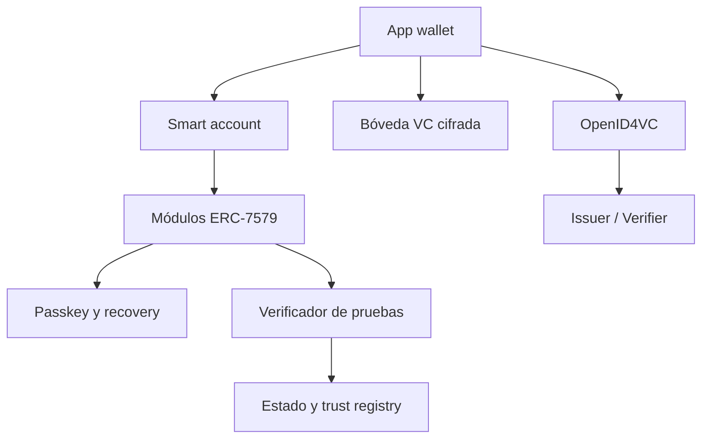

# Universal Smart Wallet

## 1. Resumen

Universal Smart Wallet es una wallet de identidad y activos basada en una smart
account programable. Permite recibir, custodiar y presentar credenciales
verificables sin publicar datos personales en blockchain.

La cuenta blockchain actúa como raíz de control y autorización. Las credenciales
se conservan cifradas fuera de cadena y se presentan mediante OpenID4VP,
selective disclosure o pruebas zero-knowledge. La validación se realiza
off-chain por defecto; una aplicación puede solicitar verificación on-chain
cuando el resultado deba activar lógica de un contrato.

## 2. Problema

Las wallets cripto y las wallets de identidad suelen ser productos separados:

- una EOA gestiona activos, pero tiene recuperación y permisos limitados;
- una wallet SSI gestiona credenciales, pero normalmente no puede actuar como
  cuenta programable dentro de una dApp;
- publicar identidad o credenciales completas on-chain rompe privacidad,
  complica el borrado y aumenta el coste;
- las integraciones actuales suelen depender de formatos o redes particulares.

## 3. Propuesta

Construir una smart wallet modular que unifique:

1. Una smart account ERC-4337 compatible con ERC-1271 y ERC-7579.
2. Una identidad DID controlada por la smart account.
3. Una bóveda local cifrada para Verifiable Credentials.
4. Emisión y presentación mediante OpenID4VCI y OpenID4VP.
5. Verificación off-chain de firma, issuer, estado, audience, nonce y control
   del holder.
6. Un módulo opcional para validar attestations o pruebas ZK on-chain.
7. Recuperación social, passkeys y rotación de controladores sin cambiar la
   identidad pública.

## 4. Principios

- Privacidad por defecto: ninguna VC completa se almacena on-chain.
- Verificación off-chain por defecto.
- Divulgación mínima: compartir atributos, no documentos completos.
- Identidad separada de las claves: rotar claves no destruye la identidad.
- Interoperabilidad antes que formatos propietarios.
- Portabilidad: exportación cifrada de credenciales y configuración.
- Modularidad: identidad, recuperación y verificación son módulos sustituibles.
- Minimización de confianza: no depender de un único indexador o proveedor.

## 5. Actores

| Actor | Responsabilidad |
| --- | --- |
| Holder | Controla la smart account y decide qué atributos presenta |
| Issuer | Emite y mantiene el estado de una credencial |
| Verifier | Solicita y valida una presentación |
| Guardian | Participa en la recuperación de la cuenta |
| Bundler | Procesa UserOperations ERC-4337 |
| Paymaster | Patrocina gas bajo una política definida |
| Trust Registry | Publica emisores y esquemas aceptados |

## 6. Arquitectura



### 6.1 Smart account

- ERC-4337 para UserOperations, bundlers y paymasters.
- ERC-1271 para validación de firmas de una cuenta contrato.
- ERC-7579 para módulos interoperables.
- Passkey/WebAuthn como autenticador principal.
- Guardianes y timelock para recuperación.
- Session keys limitadas por tiempo, contrato y función.

### 6.2 Identidad

- DID lógico vinculado al control de la smart account.
- Documento DID resoluble con claves de autenticación, assertion y servicios.
- Rotación de claves y recuperación sin reemitir toda la identidad.
- Separación entre identificador público estable y direcciones/controladores.

La elección definitiva del método DID debe tomarse después del prototipo:
`did:pkh` ofrece simplicidad; `did:ethr` ofrece delegación y rotación más
explícitas; un método propio solo se justifica si ninguno cubre los requisitos.

### 6.3 Credenciales

- W3C Verifiable Credentials Data Model 2.0.
- Compatibilidad inicial con SD-JWT VC.
- OpenID4VCI para emisión.
- OpenID4VP para presentación.
- Bóveda cifrada en el dispositivo, con copia exportable cifrada.
- Indexación local por issuer, tipo, fecha y estado.

### 6.4 Verificación off-chain

El verifier recibe una presentación y comprueba:

1. autenticidad e integridad criptográfica;
2. issuer y cadena de confianza;
3. esquema y claims solicitados;
4. expiración y estado/revocación;
5. audience y nonce para impedir replay;
6. control del holder mediante holder binding o challenge-response;
7. política local de aceptación.

El resultado puede quedarse en la sesión o convertirse en una attestation de
corta duración, sin copiar los datos personales originales.

### 6.5 Verificación on-chain

Solo se usa cuando un contrato necesita consumir el resultado:

- el holder genera una prueba ZK o una attestation firmada;
- el módulo verifica la prueba, issuer, policy ID, nonce y expiración;
- el contrato consumidor recibe únicamente un booleano o claims públicos
  mínimos;
- los nullifiers evitan reutilización cuando sea necesario.

## 7. Casos de uso iniciales

### Caso A: acceso por mayoría de edad

El usuario demuestra `age >= 18` sin revelar fecha de nacimiento. El verifier
valida off-chain y abre la sesión.

### Caso B: dApp regulada

El usuario demuestra que posee una credencial KYC válida. Una attestation
temporal permite a la smart account ejecutar una función concreta.

### Caso C: membresía

Una organización emite una VC de miembro. La wallet la presenta con OpenID4VP
y obtiene acceso sin crear otra cuenta y contraseña.

### Caso D: recuperación

El usuario pierde el dispositivo. Guardianes y timelock rotan el autenticador de
la smart account; la identidad pública permanece estable y se restaura la bóveda
desde un backup cifrado.

## 8. MVP

### Dentro del MVP

- Aplicación web/PWA con passkey.
- Despliegue determinista de una smart account en una testnet EVM.
- Módulo de recovery básico.
- DID controlado por la cuenta.
- Recepción de una credencial SD-JWT VC mediante OpenID4VCI.
- Almacenamiento local cifrado.
- Presentación OpenID4VP con selective disclosure.
- Verificador web off-chain.
- Registro mínimo de issuers y credential schemas.
- Demo de mayoría de edad o membresía.

### Fuera del MVP

- Mainnet y custodia de activos de valor.
- Método DID propio.
- Compatibilidad simultánea con todos los formatos VC.
- Marketplace de emisores.
- Biometría propia.
- Pruebas ZK arbitrarias o circuitos universales.
- Aplicaciones móviles nativas.

## 9. Stack propuesto

| Área | Tecnología |
| --- | --- |
| Frontend | Next.js, TypeScript, PWA |
| Smart account | ERC-4337 + ERC-7579 + ERC-1271 |
| Contratos | Solidity + Foundry |
| Autenticación | WebAuthn/passkeys |
| Identidad | DID Core |
| Credenciales | VC 2.0, SD-JWT VC |
| Protocolos | OpenID4VCI, OpenID4VP |
| Almacenamiento | IndexedDB cifrada; backup cifrado exportable |
| Criptografía | WebCrypto y librerías auditadas |
| Tests | Foundry, Vitest y Playwright |

Conviene integrar una implementación existente de smart accounts y evitar crear
la cuenta base desde cero. El código propio debe concentrarse en los módulos de
identidad, política y presentación.

## 10. Componentes

```text
apps/
  wallet-web/
  issuer-demo/
  verifier-demo/
packages/
  identity-core/
  credential-vault/
  openid4vc-client/
  presentation-policy/
  shared-types/
contracts/
  src/
    modules/IdentityModule.sol
    modules/RecoveryModule.sol
    modules/CredentialProofModule.sol
    registry/TrustedIssuerRegistry.sol
    registry/CredentialSchemaRegistry.sol
  script/
  test/
docs/
  architecture/
  protocols/
  threat-model/
```

## 11. Interfaces mínimas

### Presentation policy

```json
{
  "type": "sovereign.presentation-policy.v0",
  "id": "age-over-18",
  "acceptedCredentialTypes": ["AgeCredential"],
  "trustedIssuerRegistry": "eip155:chainId:address",
  "constraints": [{ "claim": "ageOver", "operator": ">=", "value": 18 }],
  "disclosure": [],
  "maxCredentialAge": 86400
}
```

### Verification result

```json
{
  "type": "sovereign.verification-result.v0",
  "policyId": "age-over-18",
  "subjectBinding": "opaque-holder-binding",
  "verified": true,
  "issuedAt": 0,
  "expiresAt": 0,
  "nonce": "random-challenge"
}
```

## 12. Modelo de amenazas

El MVP debe cubrir al menos:

- robo o pérdida del dispositivo;
- phishing de una solicitud OpenID4VP;
- replay de presentaciones;
- issuer comprometido;
- estado o revocación desactualizados;
- correlación del holder entre verificadores;
- fuga de la bóveda o del backup;
- módulo malicioso o actualización insegura;
- guardianes coludidos;
- paymaster o bundler censurando operaciones;
- front-end sustituido o supply-chain comprometida.

Los controles básicos son nonce, audience binding, expiraciones cortas,
selective disclosure, cifrado local, separación de claves, timelocks, allowlists
de módulos, simulación de UserOperations y logs de consentimiento legibles.

## 13. Roadmap

### Fase 0 — Especificación

- cerrar personas, casos de uso y modelo de confianza;
- decidir smart-account implementation y método DID;
- fijar formato VC inicial;
- definir esquemas y políticas `v0`;
- completar threat model.

### Fase 1 — Cuenta e identidad

- passkey y smart account en testnet;
- ERC-1271;
- recovery;
- resolución DID y rotación de controladores.

### Fase 2 — Credenciales

- issuer demo OpenID4VCI;
- bóveda cifrada;
- listado, inspección, exportación y borrado;
- estado/revocación.

### Fase 3 — Presentación

- verifier demo OpenID4VP;
- selective disclosure;
- challenge-response y holder binding;
- motor de políticas off-chain.

### Fase 4 — Integración on-chain

- registry de issuers;
- módulo de attestations/pruebas;
- nullifier y expiración;
- dApp de ejemplo con acceso condicionado.

### Fase 5 — Hardening

- auditoría interna y fuzzing;
- pruebas de recuperación;
- análisis de privacidad y correlación;
- revisión independiente de contratos y criptografía;
- piloto limitado.

## 14. Hitos de aceptación

1. Crear una cuenta usando únicamente una passkey y gas patrocinado.
2. Recibir una VC interoperable desde el issuer demo.
3. Presentar solo el atributo solicitado al verifier demo.
4. Validar la presentación sin consultar datos personales on-chain.
5. Rotar el autenticador manteniendo cuenta e identidad.
6. Revocar una credencial y rechazar una presentación posterior.
7. Activar una función de contrato mediante una prueba/attestation temporal.
8. Exportar y restaurar la bóveda cifrada.

## 15. Decisiones abiertas

- Safe, Kernel u otra implementación como cuenta base.
- `did:pkh`, `did:ethr` o DID no anclado a una cadena.
- SD-JWT VC solamente en v0 o también W3C Data Integrity.
- Status List, registro on-chain o modelo híbrido para revocación.
- Attestation firmada frente a ZK proof en el primer flujo on-chain.
- Estrategia multi-chain: una identidad con varias cuentas o una dirección
  determinista en múltiples redes.

## 16. Primera entrega

La primera entrega debe ser un vertical slice:

```text
Crear smart account
→ recibir VC de mayoría de edad
→ guardarla cifrada
→ escanear/abrir solicitud OpenID4VP
→ aprobar divulgación mínima
→ verificar off-chain
→ acceder a la aplicación
```

Este recorrido valida la propuesta sin asumir todavía los costes y riesgos de
una integración ZK on-chain completa.
